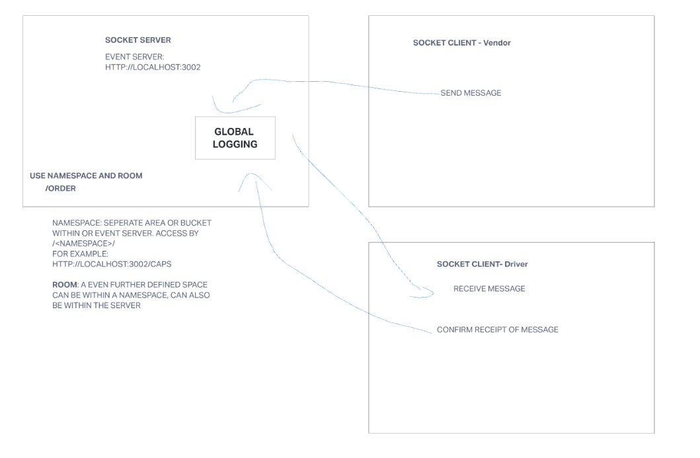

# Lab 11: Code Academy Parcel Service (CAPS)

## Event Driven Applications

Begin the build of an application for a product called CAPS - The Code Academy Parcel Service. In this sprint, we’ll build out a system that emulates a real world supply chain. CAPS will simulate a delivery service where vendors (such a flower shops) will ship products using our delivery service and when our drivers deliver them, each vendor will be notified that their customers received what they purchased.

This will be an event driven application that “distributes” the responsibility for logging to separate modules, using only events to trigger logging based on activity.

### Author: Tyler Main (Credit: Xavier Hillman (code review), Brandon Pitts, Stephen Clemmer, Stephanie Hill)

#### Setup

Open up 5 terminal tabs

Navigate to src and run: nodemon caps.js
Navigate to hub and run: nodemon index.js
Navigate to src/driver and run: nodemon index.js
Navigate to src/vendor/flowers and run: nodemon index.js
Navigate to src/vendor/widgets and run: nodemon index.js

##### Features

As a vendor, I want to alert the system when I have a package to be picked up.

As a driver, I want to be notified when there is a package to be delivered.

As a driver, I want to alert the system when I have picked up a package and it is in transit.

As a driver, I want to alert the system when a package has been delivered.

As a vendor, I want to be notified when my package has been delivered.

###### And as developers, here are some of the development stories that are relevant to the above

As a developer, I want to use industry standards for managing the state of each package.

As a developer, I want to create an event driven system so that I can write code that happens in response to events, in real time.

###### UML

